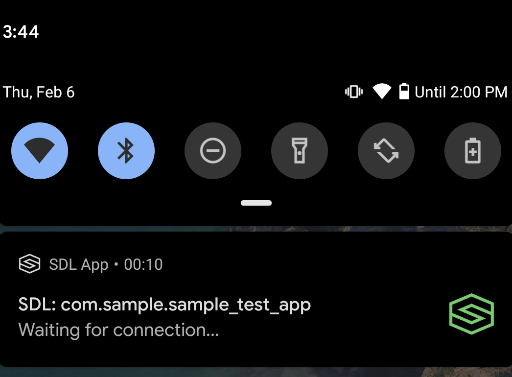
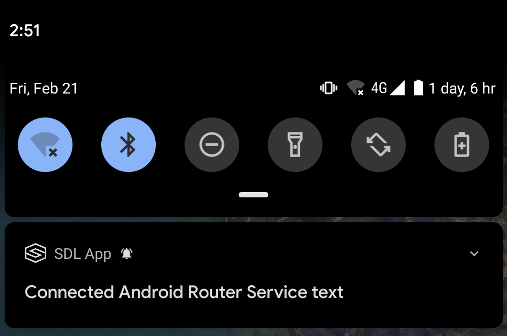
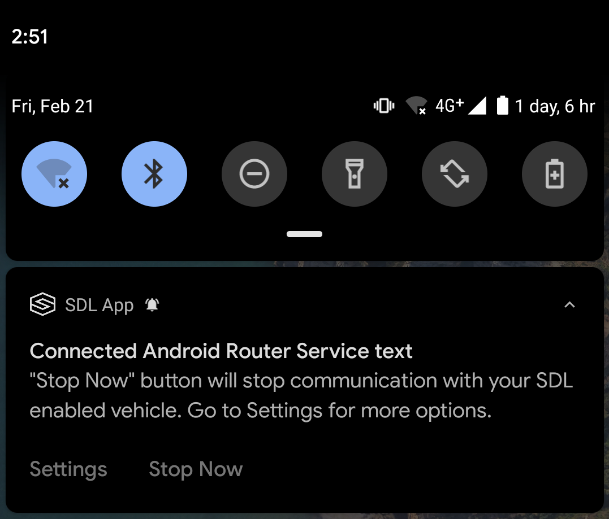
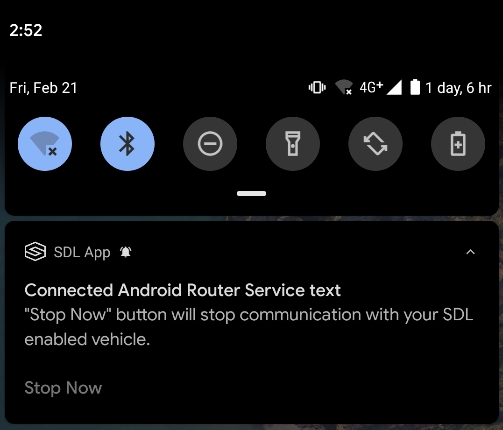

# Mitigating Android SDL service notifications issues

* Proposal: [SDL-NNNN](NNNN-android-notifications.md)
* Author: [Kujtim Shala](https://github.com/kshala-ford), [Ashwin Karemore](https://github.com/ashwink11)
* Status: **Awaiting review**
* Impacted Platforms: [Java Suite]

## Introduction

This proposal addresses an issue with Android SDL notifications forcing SDL apps to become potentially intrusive to all users with or without owning an SDL capable vehicle.

## Motivation

The SDL Android library uses Android Services for the SDL router service and the app specific SDL manager service. With Android Oreo, Google introduced background restrictions for Android Services. As a result, Services need to start in the foreground with foreground notifications in order to operate while the application is in the background. The SDL Android library creates one foreground notification for the SDL router service upon Bluetooth connection. If the router service established a connection to an SDL enabled device, each SDL application will create a foreground notification for the app specific SDL manager service. 


Notifications appearing on users' Android devices during SDL connection are shown below.



This is the first notification shown to the user when the mobile device connects to any Bluetooth device. This "Waiting for connection" notification will be shown for both SDL enabled and the non-SDL Bluetooth devices.


The above two notifications are shown by an SDL app when the mobile device is connected to the SDL enabled system. The app developers cannot influence the described behavior of these notifications. None of the foreground notifications can be dismissed like other notifications, such as push notifications. To remove or avoid showing the foreground notification, the service must be stopped programmatically. Hence, the user cannot remove the notification except by force closing the application from the device settings menu. Another option would be to hide that notification. However, many users do not want any service to run in the background if it is not doing any useful task for them. If the user doesn't have an SDL enabled system, running an SDL service on his device would not make any sense. 

Notification details provided on the SDL Developer Portal below.


Over time, many users keep complaining about the notifications shown to the user for no reason. For example, users complained recently that notifications are shown when they connect to non-SDL Bluetooth devices (e.g. Bluetooth headset, Bluetooth speakers, etc.). 

Some users have left complaints in the Google Play Store for apps integrating the latest version of the Android library in the past few months.

1. **"...option to turn off SmartDeviceLink...App constantly popping up notifications...dont want this app doing anything in the background."**

    

2. **"...quite good app but I've had to uninstall...I cann't even find any info about how to disable it..."**

    

3. Translated: **"Privacy issue...It connects or analyzes my Polar M400 sports-watch without consent..."**

    

**Feedback from App Partners**

Below comments on SDL `Waiting for connection` notifications received from app partners.

1.  "...the constant notifications that kept appearing at the top of many users’ screens saying app is searching for connection...but given the amount of negative feedback this has generated from users via the Play store and Twitter, we have made the difficult decision to remove the functionality..."

2. "...the notification shows for seconds and disappears, but this is quite a bad UX since all the users will be affected and the number of users that connect their devices to Bluetooth speakers/earphones is huge. We already received multiple bad reviews about this from our BETA testers. So, please consider fixing this asap..."

Here are some links from forum discussions in the past years. Similar to the above comments, the users in the below discussion forums complain about these SDL notifications.

[Forum discussions 1](https://eu.community.samsung.com/t5/Other-Smartphones/S8-keep-getting-a-notification-about-smartdevicelink/td-p/542988)

[Forum discussions 2](https://forums.androidcentral.com/ask-question/890465-how-get-rid-sdl.html)

[Forum discussions 3](https://www.android-hilfe.de/forum/huawei-p20-pro.3297/smartdevicelink-meldung-deaktivieren.885217.html)


This proposal describes a way in which app developers can control SDL behavior by using APIs to enable or disable it. It also proposes changes in the Android Router Service to mitigate notifications issues.

## Proposed solution

Proposed solution is described below.

### Provide API for app developers to enable/disable SDL in Android proxy

The Android proxy should provide an API to enable/disable SDL. The router service should be enabled by default. This would help many app developers to provide a setting in their app so that users can disable it if they don't have access to an SDL enabled system. This API will not influence the behavior of other SDL apps available on the users' devices.

If the SDL router service is already connected to the SDL enabled vehicle, the disable API will not have any effect on the current SDL router service session. The settings will take effect in the next run. This avoids app disconnections if the user is connected to an SDL enabled system.

The below example shows a static function that can be used by app developers to enable or disable the router service. The implementation within the SDL broadcast receiver to avoid starting the router service is internal, hence it should be considered a development detail.

```java
public class SdlRouterService extends Service {
    private static boolean isRouterServiceEnabled = true;
    
    public static void setRouterServiceEnabled(boolean flag) {
        SdlRouterService.isRouterServiceEnabled = flag;
    }
}
```

### Allow users to stop SDL foreground services

As seen in user reviews on the play store, many users want a way to stop foreground service notifications. The Android Router Service notification will provide buttons on foreground notifications, which will stop the router service and hence remove the notifications. All SDL apps connected through this Android Router Service will receive `SdlManagerListener.onDestroy` when the user stops Android Router Service and hence the apps can be notified to stop their own foreground services started for SDL. 

The SDL notification should have two buttons, `Stop Now` and `Settings`. These buttons will be shown when the user expands the notification on the Android device.





If the user clicks on the `Stop Now` button, the Android Router Service will be immediately stopped. The second button `Settings` should be shown only when the app hosting a router service provides a `PendingIntent` for the app settings page. Below is an example implementation of how an app developer can provide `PendingIntent` to be used with the `Settings` button on an Android Router Service notification. The app settings page can be used to enable/disable SDL for that specific app using the API described above.

```java
public class SdlRouterService extends Service{
   private static PendingIntent app_settings_intent=null;
    @Override
    public static void setAppSDLSettingsIntent(PendingIntent intent) {
        app_settings_intent = intent;
    }
}
```

If the SDL app did not provide `PendingIntent` for the app settings page, the Android Router Service will show only the `Stop Now` button.



### Router Service changes

This section describes the behavior of how SDL apps prepare the SDL connection to Bluetooth devices. The idea is to create the SDL proxy only while the app is in the foreground on the phone while it never connected to a head unit. It's not allowed to start the router service from the background if it does not know the connected BT device. Once the app has registered on a head unit, the proxy saves a MAC address and it's allowed to start the router service in the background in the future for the connected device.

As a result, no SDL code will cause any visible elements on the Android phone until the app has established a connection to the SDL enabled vehicle.

The first time use will be different as the phone must be unlocked and the SDL app must be in the foreground. Any subsequent BT connection to that device will make the app start the service from the background using the Android foreground notification. It's expected that the user may accept the existence of this notification, as the notifications will then be shown only when connected to the SDL enabled vehicle.

The "first-time" guide may look like the following list:

1. Connect your Android phone over Bluetooth to the infotainment system
2. Select the Applications Tab on your infotainment system
3. Start the app "APP_NAME" on your phone
4. The SDL app registers on IVI
5. Next time you enter the vehicle, you can leave your phone in the pocket. The app will recognize the vehicle and automatically connect.

**Detailed requirements**

#### 1. The app is connected to an unknown BT device, the app is in the background and there is no router service

#### Conditions

- An SDL enabled app is not in the foreground on the phone
- The app never established to register to the connected Bluetooth device
- On the phone, there is no router service provided by another app 

#### Requirements

When an app is in the background of the phone and the phone is connected to an unknown BT device, then SDL shall not start a new router service until the BT device can be verified as SDL enabled.

#### Comments

This is the case if the app is newly installed or updated with SDL support and no other SDL enabled app is installed or connected.

#### 2. The app is connected to an unknown BT device, the app is in the foreground and there is no router service

#### Conditions

- An SDL enabled app is in the foreground on the phone
- The app never established to register to the connected Bluetooth device
- On the phone, there is no router service provided by another app 

#### Requirements

1. The app should start the SDL related services as a regular service, without any foreground notification.
2. The app should keep the services up and running for the time the app is in the foreground.
3. The app should stop the services when entering the background.

#### Comments

This is required to avoid any SDL foreground notifications showing up when connected to the non-SDL enabled system.

#### 3. The app is in the foreground and has established an SDL session with a connected system

#### Conditions

- An SDL enabled app is in the foreground on the phone
- The app never established to register to the connected Bluetooth device
- On the phone, there is no router service provided by another app 
- The app has been connected and registered to the head unit

#### Requirements

1. The app should store that information
2. The router service shows foreground notifications to the user.

#### Comments

This is the end of the "first time" guide storing the information of the user owning an SDL capable device

#### 4. Router service with the app in background for known SDL BT devices

#### Conditions

- An SDL enabled app is not in the foreground on the phone
- The app established to register to the connected Bluetooth device
- On the phone, there is no router service provided by another app 

#### Requirements

The app should start the router service as a foreground service including a notification.

#### Comments

As the app knows that the device supports SDL, it can start the router service and keep it active/foregrounded

#### 5. The app connects to router service when in background

#### Conditions

- An SDL enabled app is in the foreground on the phone
- The app never established to register to the connected Bluetooth device
- On the phone, another app has created the router service

#### Requirements

1. The app's proxy should connect to the router service
2. The router service should tell the app if the connected BT device is known to support SDL

#### Comments

This behavior can exist if multiple SDL apps are installed on a user's device.

## Potential downsides

The downside is the reduced experience for the first time use as the phone must be unlocked and the app must be started. However, this proposal reduces the intrusion of SDL foreground services.

## Impact on existing code

Changes to the library can be high. It's likely that this will require a major version change as it could change critical areas of multiplexing.

## Alternatives considered

When the user stops the Android Router Service, the Android proxy can remember the MAC address of the device. It can maintain the list of MAC addresses for which the user stopped the Android Router Service. This would be a list of blocked devices. On subsequent Bluetooth connections, the Android Router Service would not be started for devices available on the blocked list. The SDL router service could provide the list of blocked devices to SDL app. The app could request this device list and re-enable SDL for the specified device. The downside of this alternative is that SDL would have to provide a standard settings screen. This settings screen could be used to see the list of blocked devices and provide the necessary user interface so that the user could enable SDL for blocked devices. Since the Android Router Service maintains the blocked device list, the settings would be shared between all SDL apps.
